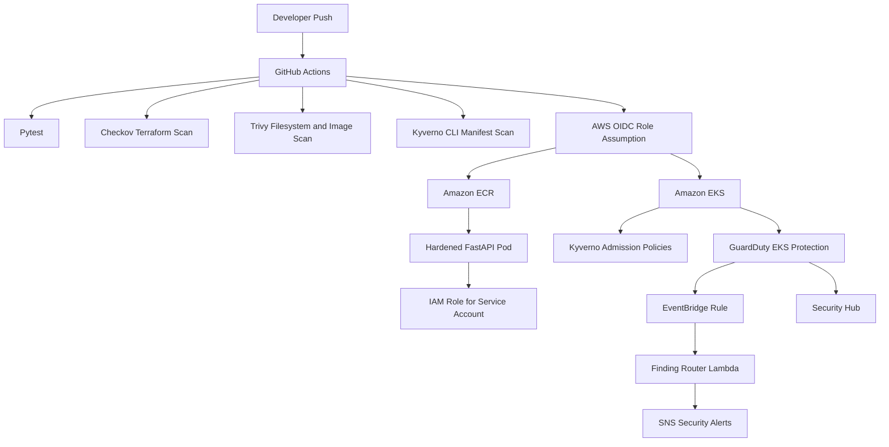

# AWS EKS Secure Delivery and Detection Lab


End-to-end cloud security portfolio project for secure software delivery, hardened Kubernetes admission control, and AWS runtime threat detection on Amazon EKS.

This lab provisions a private-by-default EKS environment, builds and deploys a hardened FastAPI workload, enforces Kubernetes policy with Kyverno, and routes high-severity GuardDuty findings through EventBridge, Lambda, and SNS.

## What This Demonstrates

- Secure AWS infrastructure with Terraform modules for VPC, EKS, ECR, KMS, CloudTrail, AWS Config, Security Hub, GuardDuty, and budget alerts.
- Passwordless GitHub Actions deployment using AWS OIDC rather than static cloud keys.
- Hardened Kubernetes workload settings: non-root user, dropped Linux capabilities, no privilege escalation, read-only root filesystem, resource limits, seccomp, network policy, and private ECR image source.
- Runtime identity isolation with IAM Roles for Service Accounts (IRSA).
- Admission control with Kyverno policies that reject unsafe Kubernetes workloads.
- Detection and response flow for high-severity GuardDuty findings using EventBridge, Lambda, and SNS.

## Current Verified State

The dev environment has been deployed and validated in `us-east-1`. Account-specific values are redacted in the public documentation.

| Area | Result |
|------|--------|
| Terraform apply | Complete |
| Terraform drift | Clean, no changes |
| EKS endpoint posture | Private endpoint enabled, public endpoint disabled |
| App deployment | `secure-demo-api` rolled out successfully |
| Image deployed | `<account-id>.dkr.ecr.us-east-1.amazonaws.com/aws-eks-secure-delivery-detection-lab-dev-api:d1bfc69` |
| App health | `/health` returned `{"status":"ok"}` |
| IRSA | `AWS_ROLE_ARN` and web identity token injected into pod |
| Kyverno workload result | secure-demo workload passed all 6 policies |
| Detection routing | GuardDuty sample finding reached EventBridge, Lambda, and SNS |
| SNS email confirmation | Confirmed; final SNS test message published |
| Tests | 6 passed |
| Checkov | 182 passed, 0 failed, 6 skipped |

See [EVIDENCE_SUMMARY.md](EVIDENCE_SUMMARY.md) for command-level evidence.

## Architecture



## Repository Map

| Path | Purpose |
|------|---------|
| `terraform/bootstrap` | One-time backend and GitHub OIDC bootstrap |
| `terraform/envs/dev` | Dev environment composition and outputs |
| `terraform/modules` | Reusable AWS modules |
| `app` | FastAPI demo service and tests |
| `lambda/guardduty_finding_router` | GuardDuty finding formatter and SNS publisher |
| `kubernetes` | Namespace, service account, deployment, service, and network policy |
| `policies/kyverno` | Admission policies for hardened workloads |
| `.github/workflows` | CI, Terraform plan, deploy, and destroy workflows |
| `runbooks` | Incident response and triage procedures |
| `evidence` | Portfolio evidence folders |

## Security Controls

| Phase | Control | Implementation |
|-------|---------|----------------|
| Code | IaC scanning | Checkov in CI and local validation |
| Code | Secret and filesystem scan | Trivy filesystem scan |
| Build | Image CVE scan | Trivy image scan, high/critical gating |
| Deploy | Cloud authentication | GitHub OIDC role, no static AWS keys |
| Deploy | Kubernetes admission | Kyverno ClusterPolicies |
| Runtime | Pod hardening | Security context, seccomp, read-only filesystem, resource limits |
| Runtime | AWS least privilege | IRSA service account annotation |
| Runtime | Network containment | Default-deny namespace policy with explicit app/DNS/HTTPS egress |
| Detect | Cloud and EKS threat detection | GuardDuty EKS audit/runtime protection |
| Respond | Alert routing | EventBridge to Lambda to SNS |

## Deployment Notes

The EKS API endpoint is private by default. For local deployment testing, temporarily enable public endpoint access to a single `/32`, deploy, then return it to private-only.

```powershell
$env:TF_VAR_cluster_endpoint_public_access='true'
$env:TF_VAR_cluster_endpoint_public_access_cidrs='["YOUR_PUBLIC_IP/32"]'
terraform -chdir=terraform/envs/dev apply -auto-approve
```

After deployment:

```powershell
Remove-Item Env:\TF_VAR_cluster_endpoint_public_access
Remove-Item Env:\TF_VAR_cluster_endpoint_public_access_cidrs
terraform -chdir=terraform/envs/dev apply -auto-approve
```

For GitHub-hosted runner deployment, use the `Deploy Dev` workflow input `cluster_endpoint_public_access_cidrs` with a tightly scoped `/32`. For a more production-like path, use a self-hosted runner inside the VPC.

## Local Validation

```powershell
terraform fmt -recursive terraform
terraform -chdir=terraform/envs/dev validate -no-color
.venv\Scripts\python.exe -m checkov.main -d terraform/ --framework terraform --skip-path terraform/envs/dev/.terraform --skip-check CKV_AWS_18,CKV_AWS_109,CKV_AWS_111,CKV_AWS_144,CKV_AWS_274,CKV_AWS_356,CKV_TF_1,CKV_TF_2,CKV2_AWS_56,CKV2_AWS_62,CKV2_AWS_64
.venv\Scripts\pytest.exe app/tests/ lambda/guardduty_finding_router/tests/
kyverno apply policies/kyverno --resource kubernetes/deployment.yaml
```

## Cleanup

This lab creates billable AWS resources, including EKS, NAT Gateway, EC2 nodes, GuardDuty, CloudTrail logs, and related storage. Destroy the dev stack when finished:

```powershell
terraform -chdir=terraform/envs/dev destroy -auto-approve
```

Confirm in AWS that EKS, NAT Gateway, EC2 worker nodes, and load balancer resources are gone. See [COST_AND_CLEANUP.md](COST_AND_CLEANUP.md).

## Portfolio Narrative

This project is designed to show practical Cloud Security Engineering, DevSecOps, and Detection Engineering skills in one cohesive lab:

- Prevent insecure infrastructure and workloads from shipping.
- Deploy through short-lived identities and private infrastructure.
- Enforce runtime least privilege.
- Detect suspicious EKS and AWS behavior.
- Route actionable findings to a human alert channel.
