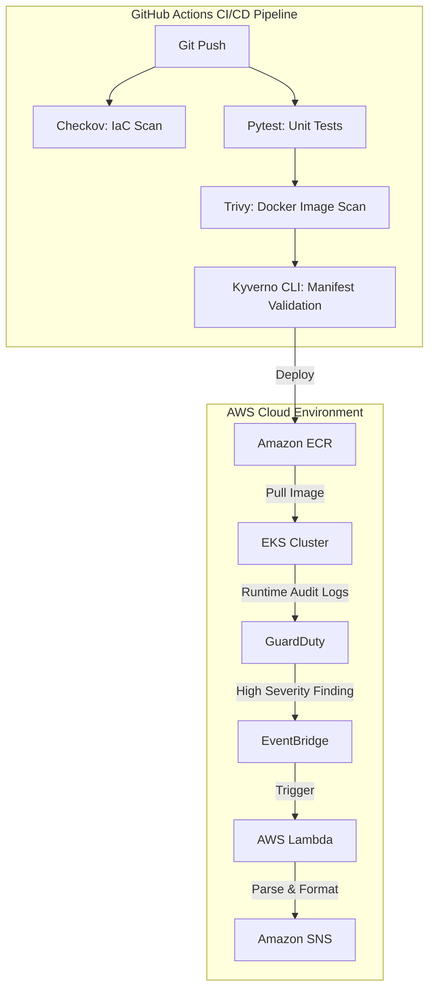

# AWS EKS Secure Delivery & Detection Lab


An enterprise-grade, end-to-end secure delivery pipeline and runtime threat detection lab built on AWS Elastic Kubernetes Service (EKS). 

This project demonstrates how to securely architect, deliver, and monitor a containerized application in the cloud. It implements **DevSecOps** best practices by shifting security left into the CI/CD pipeline and extending it right into the runtime environment using native AWS security services and CNCF open-source tools.

---

## 🏗️ Architecture

### Secure Delivery Pipeline
1. **Developer Push**: Code is pushed to GitHub.
2. **Infrastructure Validation**: GitHub Actions run `checkov` to scan Terraform IaC for misconfigurations before deployment.
3. **Container Security**: The FastAPI Python application is containerized and scanned with `Trivy` to block high/critical vulnerabilities and hardcoded secrets.
4. **Admission Control**: Kubernetes manifests are validated locally against `Kyverno` policies to ensure compliance (no privileged containers, enforce resource limits).

### Runtime Threat Detection
Once deployed on AWS EKS, the cluster is actively monitored:
- **GuardDuty EKS Protection**: Analyzes Kubernetes audit logs and runtime behavior to detect threats (e.g., reverse shells, crypto-mining).
- **Security Hub**: Aggregates security posture and compliance checks.
- **Automated Routing**: AWS EventBridge captures high-severity findings and triggers an AWS Lambda function.
- **Alerting**: The Lambda parses the threat intelligence and dispatches a formatted alert to the administrator via Amazon SNS.



---

## 🛠️ Technology Stack

- **Cloud Provider:** Amazon Web Services (AWS)
- **Infrastructure as Code:** Terraform (Modules: VPC, EKS, ECR, IAM, KMS)
- **Containerization & App:** Docker, Python, FastAPI
- **CI/CD:** GitHub Actions
- **Security Tools:**
  - **Checkov:** IaC Security Scanning
  - **Trivy:** Container Vulnerability & Secret Scanning
  - **Kyverno:** Kubernetes Native Policy Management / Admission Control
  - **Amazon GuardDuty:** Runtime Threat Detection
  - **AWS Security Hub:** Posture Management

---

## 🛡️ Threat Model Mitigations

| Threat Vector | Mitigation Strategy | Tooling |
|--------------|---------------------|---------|
| **Vulnerable Base Images** | Pipeline breaks if Critical/High CVEs are found in the Dockerfile or base image. | Trivy (CI) |
| **Hardcoded Secrets** | Filesystem scan prevents AWS Keys or API tokens from being committed. | Trivy (CI) |
| **Cloud Misconfigurations** | Blocks insecure IaC (e.g., unencrypted ECR, open Security Groups). | Checkov (CI) |
| **Container Escapes** | Blocks privileged pods, enforces read-only root filesystems, and requires resource limits. | Kyverno (Admission) |
| **Runtime Exploitation** | Detects unauthorized executions, reverse shells, or access to sensitive EC2 metadata. | GuardDuty (Runtime) |

---

## 🚀 Deployment Runbook

### Prerequisites
- AWS CLI configured with Administrator access.
- Terraform (`>= 1.5.0`) installed.
- Docker & kubectl installed.

### 1. Provision Infrastructure
Deploy the underlying AWS network, EKS cluster, container registry, and threat detection pipeline.
```bash
cd terraform/envs/dev
terraform init
terraform apply -auto-approve
```
*Note: You will receive an email from AWS SNS asking you to confirm your subscription for GuardDuty alerts.*

### 2. Connect to the EKS Cluster
Update your local `kubeconfig` to communicate with the newly provisioned cluster.
```bash
aws eks update-kubeconfig --region us-east-1 --name aws-eks-secure-delivery-detection-lab-dev
```

### 3. Deploy Kyverno Admission Controller
Install the Kyverno helm chart and apply the security policies to the cluster.
```bash
cd kubernetes
./install-kyverno.sh
```

### 4. Deploy the Application
Deploy the hardened FastAPI application.
```bash
kubectl apply -f hardened-deployment.yaml
```

### 5. Test the Security Boundaries
Attempt to deploy the purposely vulnerable manifest. It will be instantly rejected by Kyverno!
```bash
kubectl apply -f insecure-deployment.yaml
# Expected Output: Error from server: admission webhook "validate.kyverno.svc-fail" denied the request...
```

---

## 🧹 Cleanup

To destroy all infrastructure and stop incurring AWS charges:
```bash
cd terraform/envs/dev
terraform destroy -auto-approve
```

---

*This project was built to demonstrate an understanding of Cloud Security, Kubernetes Administration, and DevSecOps engineering.*
