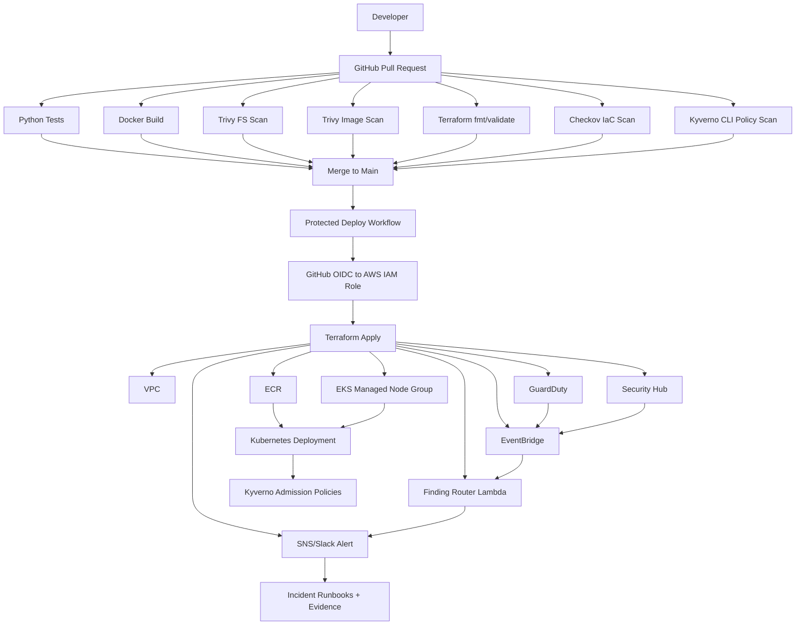

# AWS EKS Secure Delivery & Runtime Detection Lab — Complete Design Document

**Repository name:** `aws-eks-secure-delivery-detection-lab`  
**Portfolio title:** AWS EKS Secure Delivery & Runtime Detection Lab  
**Document version:** 1.0  
**Last updated:** 2026-05-21  
**Primary audience:** Cloud Security, DevSecOps, SOC/Detection Engineering, and Junior Security Engineer recruiters/interviewers

---

## 1. Executive Summary

This project builds a compact but portfolio-ready AWS EKS security lab that proves secure delivery from code commit to Kubernetes runtime.

The final project demonstrates that a developer cannot easily push insecure infrastructure, a vulnerable container image, or a dangerous Kubernetes workload into the cluster without being blocked, flagged, or routed into a documented detection-and-response workflow.

The lab uses:

- **Terraform** for AWS infrastructure provisioning.
- **Amazon EKS** for Kubernetes workload hosting.
- **Amazon ECR** for container image storage.
- **GitHub Actions** for CI/CD security gates.
- **Checkov** for infrastructure-as-code scanning.
- **Trivy** for filesystem/image scanning, with strict pinning due to recent supply-chain risk.
- **Kyverno** for Kubernetes policy-as-code admission controls.
- **Amazon GuardDuty EKS Protection and Runtime Monitoring** for detection.
- **AWS Security Hub CSPM** for posture and evidence.
- **EventBridge + Lambda + SNS or Slack** for finding routing.
- **Runbooks and evidence folders** to make the work portfolio-ready.

The project intentionally avoids building a large application. The focus is the secure delivery and detection chain.

---

## 2. Evaluation of the Original Design

The original design is strong because it targets a real gap in a cybersecurity portfolio: cloud-native security at the code-to-cluster boundary. It correctly includes EKS, Terraform, ECR, GitHub Actions, IaC scanning, container scanning, Kubernetes policies, GuardDuty, Security Hub, detection routing, and runbooks.

However, the design needs several corrections and additions before implementation.

### 2.1 What Was Already Good

| Area | Evaluation |
|---|---|
| Portfolio relevance | Strong. EKS + DevSecOps + detection is highly marketable. |
| Tool selection | Strong. Terraform, GitHub Actions, Checkov, Trivy, Kyverno, GuardDuty, and Security Hub are recognizable tools. |
| Evidence-driven design | Strong. The misconfigure → detect/block → fix → verify scenarios are excellent portfolio material. |
| Scope control | Mostly good. The app is intentionally simple, which keeps the focus on security engineering. |
| Recruiter readability | Good. The project can be explained through architecture, controls matrix, screenshots, and runbooks. |

### 2.2 Gaps Fixed in This Version

| Gap | Fix |
|---|---|
| No explicit phase plan | Added implementation phases with deliverables and exit criteria. |
| GuardDuty Runtime Monitoring and EKS Fargate ambiguity | Use **managed EC2 node groups** for MVP because GuardDuty Runtime Monitoring does not support EKS clusters running on AWS Fargate. |
| CloudTrail was in the architecture but missing as a Terraform module | Added a `cloudtrail` module. |
| Security Hub controls may require AWS Config coverage | Added an `aws-config` module for posture evidence where required. |
| CI/CD action supply-chain risk | Added SHA pinning / version pinning requirements, especially for Trivy-related actions. |
| No GitHub OIDC trust boundary | Added GitHub Actions → AWS OIDC deployment role with scoped `sub` conditions. |
| No branch/environment protection model | Added `dev` environment, protected deploy workflow, and least-privilege GitHub permissions. |
| No specific EKS hardening requirements | Added private endpoint preference, KMS secrets encryption, control plane logging, IRSA, minimal RBAC, network policy enablement, and node group hardening. |
| NetworkPolicy assumptions were under-specified | Added requirement to enable Amazon VPC CNI network policy support or document the chosen CNI behavior. |
| No exact evidence checklist | Added file-by-file evidence requirements. |
| No cleanup safety model | Added budget alarms, TTL tags, destroy workflow, and cost checklist. |
| No portfolio release criteria | Added public-release checklist and case-study structure. |

---

## 3. Project Goal

Build a small but complete AWS EKS environment where each stage of the delivery path has a security control:

1. **Code and infrastructure are scanned before merge.**
2. **Container images are scanned before release.**
3. **Kubernetes manifests are checked before deployment.**
4. **Admission policies block unsafe workloads at the cluster boundary.**
5. **GuardDuty detects suspicious EKS and runtime activity.**
6. **Security Hub stores posture/compliance evidence.**
7. **EventBridge routes findings into a human-readable alert.**
8. **Runbooks explain triage, containment, remediation, and verification.**

The project should answer one portfolio question:

> “Can I design and implement a secure cloud-native deployment pipeline with prevention, detection, response, evidence, and cleanup?”

---

## 4. Non-Goals

The MVP should not become too large. These are intentionally out of scope for the first release:

- Production-grade multi-account AWS Organizations deployment.
- Multi-region EKS.
- Service mesh.
- Full SIEM integration.
- Complex microservices.
- Production incident response automation that runs destructive containment actions.
- Real malicious traffic or uncontrolled attack simulation.
- Long-running public infrastructure.

Stretch goals can be added later, but the MVP should remain focused and finishable.

---

## 5. Target Roles and Portfolio Messaging

| Target Role | What This Project Proves |
|---|---|
| Cloud Security Engineer | Terraform, EKS, IAM, IRSA, KMS, GuardDuty, Security Hub, cloud posture evidence. |
| DevSecOps Engineer | PR gates, CI/CD security checks, image scanning, IaC scanning, policy-as-code. |
| SOC Analyst / Detection Engineer | GuardDuty finding analysis, EventBridge routing, Lambda enrichment, runbooks. |
| Junior Security Engineer | Clear security controls, alert triage, remediation documentation, AWS fundamentals. |
| Cloud Security Analyst | Security Hub evidence, misconfiguration findings, control mapping, remediation proof. |

Suggested portfolio summary:

> Built an AWS EKS security lab that enforces secure delivery from pull request to runtime using Terraform, GitHub Actions, Checkov, Trivy, Kyverno, GuardDuty, Security Hub, EventBridge, and runbook-driven response.

---

## 6. MVP Scope

| Area | MVP Decision |
|---|---|
| Cloud | AWS |
| Region | `us-east-1` by default, configurable |
| IaC | Terraform |
| Kubernetes | Amazon EKS |
| Compute | Managed EC2 node group, not Fargate for MVP |
| App | Minimal FastAPI service |
| Registry | Amazon ECR |
| CI/CD | GitHub Actions |
| Auth from CI to AWS | GitHub OIDC, no static AWS keys |
| IaC scanning | Checkov |
| Container/filesystem scanning | Trivy with pinned versions/actions |
| Kubernetes policy | Kyverno |
| Runtime detection | GuardDuty EKS Protection + GuardDuty Runtime Monitoring |
| Posture evidence | AWS Security Hub CSPM |
| Event routing | EventBridge |
| Alerting | SNS email first; Slack webhook optional |
| Response | Markdown runbooks |
| Evidence | Screenshots, logs, JSON findings, before/after examples |
| Cleanup | Terraform destroy workflow + budget alarm + cost guide |

---

## 7. High-Level Architecture

```text
Developer
   |
   v
GitHub Pull Request
   |
   |-- Python tests
   |-- Docker build
   |-- Trivy filesystem/dependency scan
   |-- Trivy image scan
   |-- Terraform fmt/validate
   |-- Checkov Terraform scan
   |-- Kyverno CLI manifest scan
   |-- SARIF/security artifacts uploaded
   |
   v
Approved merge to main
   |
   v
Protected GitHub Actions deploy-dev workflow
   |
   |-- GitHub OIDC assumes scoped AWS deploy role
   |-- Terraform apply provisions AWS resources
   |-- Image pushed to ECR
   |-- Kubernetes manifests deployed
   |
   v
AWS Environment
   |
   |-- VPC
   |-- EKS managed node group
   |-- ECR
   |-- IAM / IRSA
   |-- KMS
   |-- CloudTrail
   |-- CloudWatch Logs
   |-- GuardDuty EKS Protection
   |-- GuardDuty Runtime Monitoring
   |-- AWS Config
   |-- Security Hub
   |-- EventBridge
   |-- Lambda finding enricher
   |-- SNS / optional Slack webhook
   |
   v
Evidence + Runbooks + Portfolio Case Study
```

---

## 8. Trust Boundaries

| Boundary | Risk | Control |
|---|---|---|
| Developer workstation → GitHub | Malicious or accidental insecure code | PR review, branch protection, CI checks |
| GitHub Actions → AWS | Credential theft or overbroad deployment role | OIDC, scoped trust policy, least-privilege IAM, no static keys |
| Terraform → AWS | Misconfigured infrastructure | Checkov, Terraform plan review, least-privilege deploy role |
| ECR → EKS | Vulnerable or untrusted image deployed | Trivy scan, ECR-only image policy, immutable tags |
| Kubernetes API → Workload runtime | Privileged/root workload | Kyverno admission policies |
| Pod → AWS APIs | AWS credential abuse | IRSA, block IMDS where possible, least privilege |
| Cluster → Internet | Lateral movement / data exfiltration | Network policies, restricted egress where feasible |
| Findings → Human response | Alert fatigue or missing context | Lambda enrichment, severity filter, runbook links |

---

## 9. Final Repository Structure

Use this exact structure.

```text
aws-eks-secure-delivery-detection-lab/
│
├── README.md
├── PROJECT_BRIEF.md
├── ARCHITECTURE.md
├── THREAT_MODEL.md
├── CONTROLS_MATRIX.md
├── COST_AND_CLEANUP.md
├── LESSONS_LEARNED.md
├── PORTFOLIO_CASE_STUDY.md
├── SECURITY_NOTES.md
├── Makefile
│
├── app/
│   ├── Dockerfile
│   ├── requirements.txt
│   ├── pyproject.toml
│   ├── src/
│   │   └── main.py
│   └── tests/
│       └── test_health.py
│
├── terraform/
│   ├── backend.tf
│   ├── providers.tf
│   ├── variables.tf
│   ├── outputs.tf
│   ├── versions.tf
│   ├── main.tf
│   ├── modules/
│   │   ├── vpc/
│   │   ├── eks/
│   │   ├── ecr/
│   │   ├── iam/
│   │   ├── kms/
│   │   ├── cloudtrail/
│   │   ├── aws-config/
│   │   ├── securityhub/
│   │   ├── detection/
│   │   └── budget/
│   └── envs/
│       └── dev/
│           ├── main.tf
│           ├── terraform.tfvars.example
│           └── README.md
│
├── kubernetes/
│   ├── namespace.yaml
│   ├── service-account.yaml
│   ├── deployment.yaml
│   ├── service.yaml
│   ├── ingress.yaml
│   ├── network-policy.yaml
│   ├── hardened-deployment.yaml
│   └── intentionally-insecure/
│       ├── privileged-pod.yaml
│       ├── root-container.yaml
│       ├── no-resource-limits.yaml
│       └── wrong-registry.yaml
│
├── policies/
│   ├── kyverno/
│   │   ├── disallow-privileged.yaml
│   │   ├── require-non-root.yaml
│   │   ├── require-readonly-rootfs.yaml
│   │   ├── require-resource-limits.yaml
│   │   ├── disallow-hostpath.yaml
│   │   └── require-image-registry.yaml
│   ├── checkov/
│   │   └── custom-required-tags.yaml
│   └── trivy/
│       └── trivy.yaml
│
├── lambda/
│   └── guardduty_finding_router/
│       ├── handler.py
│       ├── requirements.txt
│       └── tests/
│           └── test_handler.py
│
├── evidence/
│   ├── screenshots/
│   ├── checkov-before-after/
│   ├── trivy-before-after/
│   ├── kyverno-policy-results/
│   ├── guardduty-findings/
│   ├── securityhub-controls/
│   ├── eventbridge-routing/
│   └── runbook-walkthrough/
│
├── runbooks/
│   ├── guardduty-eks-finding-triage.md
│   ├── vulnerable-image-response.md
│   ├── privileged-pod-response.md
│   └── ci-supply-chain-incident-response.md
│
└── .github/
    ├── workflows/
    │   ├── pr-security-checks.yml
    │   ├── terraform-plan.yml
    │   ├── deploy-dev.yml
    │   └── destroy-dev.yml
    └── dependabot.yml
```

---

## 10. Application Design

### 10.1 App Choice

Use **FastAPI** instead of Flask for slightly cleaner OpenAPI documentation and health endpoints.

The application must be intentionally simple.

### 10.2 Endpoints

| Endpoint | Method | Purpose |
|---|---:|---|
| `/health` | GET | Liveness/readiness probe target |
| `/version` | GET | Shows app version, commit SHA, and image tag |
| `/metadata` | GET | Shows safe runtime metadata only; must not expose secrets |

### 10.3 Required Behavior

`GET /health`

```json
{
  "status": "ok"
}
```

`GET /version`

```json
{
  "service": "eks-secure-demo-api",
  "version": "0.1.0",
  "commit": "GITHUB_SHA",
  "image": "ECR_IMAGE_URI"
}
```

`GET /metadata`

```json
{
  "environment": "dev",
  "region": "us-east-1",
  "secret_loaded": true,
  "secret_value": "redacted"
}
```

### 10.4 Container Requirements

| Control | Requirement |
|---|---|
| Base image | Small supported Python image or distroless-style image |
| User | Non-root user |
| Filesystem | Read-only root filesystem in Kubernetes |
| Linux capabilities | Drop all |
| Privileged mode | Disabled |
| Resource limits | Required |
| Secrets | No hardcoded secrets |
| Config | Environment variables or Kubernetes ConfigMap |
| Image storage | ECR |
| Image tag | Commit SHA or semantic version |
| Latest tag | Avoid relying on `latest` for deploys |
| Health probes | Liveness and readiness probes enabled |

### 10.5 Dockerfile Requirements

The Dockerfile should:

- Use a supported base image.
- Install only required dependencies.
- Create a non-root user.
- Avoid copying unnecessary files.
- Avoid package-manager caches in final image.
- Expose only the app port.
- Use `CMD` or `ENTRYPOINT` clearly.

---

## 11. AWS Architecture

### 11.1 AWS Components

| Component | Purpose |
|---|---|
| VPC | Isolated network for the EKS cluster |
| Public subnets | Load balancer entry only |
| Private subnets | EKS managed nodes |
| EKS | Managed Kubernetes control plane |
| Managed node group | EC2-backed worker nodes for runtime monitoring compatibility |
| ECR | Container registry |
| IAM | AWS permissions |
| IRSA | Scoped pod-level AWS permissions |
| KMS | Encrypt EKS secrets and logs where applicable |
| CloudTrail | AWS API audit trail |
| CloudWatch Logs | EKS/app/log routing |
| GuardDuty | EKS audit/runtime threat detection |
| AWS Config | Resource configuration recording for posture controls |
| Security Hub | CSPM and centralized findings |
| EventBridge | Finding routing |
| Lambda | Finding parser/enricher |
| SNS | Email alerting |
| Slack webhook | Optional alert destination |
| AWS Budget | Cost control |

### 11.2 EKS Design Decisions

| Setting | MVP Decision |
|---|---|
| Cluster endpoint | Prefer private endpoint; public endpoint only if needed and restricted by CIDR |
| Kubernetes version | Current supported EKS standard-support version at implementation time |
| Node type | Small managed node group |
| Node count | 1-2 nodes for MVP |
| Node scaling | Low min/max to reduce cost |
| Secrets encryption | KMS-backed Kubernetes secrets encryption |
| Control plane logs | Enable API, audit, authenticator, controllerManager, scheduler logs |
| IRSA/OIDC | Enabled |
| Add-ons | VPC CNI, CoreDNS, kube-proxy, EBS CSI if needed, GuardDuty agent |
| Network policy | Enable Amazon VPC CNI network policy support or document alternative CNI |
| Public workloads | Only demo service/ingress if needed |
| Fargate | Out of scope for MVP due GuardDuty Runtime Monitoring limitation |

---

## 12. Terraform Design

### 12.1 Terraform Principles

- Use modules.
- Use a single `dev` environment.
- Keep variables readable.
- Add tags to all taggable resources.
- Do not store state in the repo.
- Use remote state only after local MVP works.
- Do not commit secrets.
- Keep destroy simple.

### 12.2 Required Tags

All AWS resources that support tags should include:

```hcl
Project     = "aws-eks-secure-delivery-detection-lab"
Environment = "dev"
Owner       = "Aryan"
ManagedBy   = "terraform"
TTL         = "manual-destroy"
CostCenter  = "portfolio-lab"
```

### 12.3 Module Responsibilities

#### `modules/vpc`

Creates:

- VPC
- 2 public subnets
- 2 private subnets
- Internet gateway
- Route tables
- NAT gateway only if required
- Security groups
- VPC flow logs optional stretch

Cost note: NAT Gateway can be expensive for a lab. Prefer a design that avoids NAT Gateway where possible, or destroy quickly after evidence capture.

#### `modules/ecr`

Creates:

- ECR repository
- Image scan settings if used
- Image tag immutability if feasible
- Lifecycle policy to expire old images

#### `modules/kms`

Creates:

- KMS key for EKS secrets encryption
- KMS alias
- Key policy scoped to EKS/admin roles

#### `modules/eks`

Creates:

- EKS cluster
- Managed node group
- EKS OIDC provider
- Control plane logging
- EKS add-ons
- Security group rules
- KMS secrets encryption configuration

#### `modules/iam`

Creates:

- EKS cluster role
- Node group role
- GitHub Actions deploy role using OIDC
- IRSA app role
- Lambda role
- Least-privilege policies

#### `modules/cloudtrail`

Creates:

- Trail for management events
- S3 bucket for CloudTrail logs
- KMS encryption if feasible
- Log file validation if feasible

#### `modules/aws-config`

Creates:

- AWS Config recorder
- Delivery channel
- S3 bucket for configuration snapshots
- Required role/policy

#### `modules/securityhub`

Creates/enables:

- Security Hub
- Foundational security controls
- EKS-related controls
- GuardDuty integration evidence

#### `modules/detection`

Creates/enables:

- GuardDuty detector
- EKS audit log monitoring
- Runtime Monitoring for EKS resources
- GuardDuty agent management where supported
- EventBridge rule for GuardDuty findings
- Lambda function
- SNS topic
- SNS subscription
- Lambda permissions
- CloudWatch log group

#### `modules/budget`

Creates:

- Monthly AWS Budget alert
- Email notification threshold

### 12.4 Terraform Outputs

Required outputs:

```hcl
output "cluster_name" {}
output "cluster_endpoint" {}
output "ecr_repository_url" {}
output "github_actions_role_arn" {}
output "sns_topic_arn" {}
output "securityhub_account_id" {}
output "guardduty_detector_id" {}
```

---

## 13. IAM and CI/CD Authentication Design

### 13.1 No Static AWS Keys in GitHub

GitHub Actions must use **OIDC** to assume an AWS IAM role. Do not store `AWS_ACCESS_KEY_ID` or `AWS_SECRET_ACCESS_KEY` in GitHub secrets.

### 13.2 GitHub OIDC Trust Policy

The AWS deploy role trust policy should be scoped to the exact repository and branch/environment.

Example condition pattern:

```json
{
  "StringEquals": {
    "token.actions.githubusercontent.com:aud": "sts.amazonaws.com",
    "token.actions.githubusercontent.com:sub": "repo:OWNER/aws-eks-secure-delivery-detection-lab:environment:dev"
  }
}
```

Use GitHub Environments for `dev`, and protect the environment if the repo is public.

### 13.3 GitHub Workflow Permissions

Each workflow should set the minimum permissions it needs.

Example:

```yaml
permissions:
  contents: read
  id-token: write
  security-events: write
```

Do not grant broad write permissions unless required.

---

## 14. CI/CD Security Pipeline

### 14.1 PR Workflow: `.github/workflows/pr-security-checks.yml`

Runs on:

```yaml
on:
  pull_request:
    branches: ["main"]
```

Required jobs:

| Job | Tool | Fail Condition |
|---|---|---|
| Python tests | pytest | Any test failure |
| Docker build | docker build | Build failure |
| Filesystem scan | Trivy | Critical vulnerability or secret |
| Image scan | Trivy | Critical vulnerability |
| Terraform format | terraform fmt | Formatting mismatch |
| Terraform validate | terraform validate | Invalid Terraform |
| IaC scan | Checkov | High/Critical IaC finding |
| K8s policy scan | Kyverno CLI | Policy violation |
| SARIF upload | GitHub Code Scanning | Upload failure should not hide scan failure |

### 14.2 Terraform Plan Workflow: `.github/workflows/terraform-plan.yml`

Runs on:

- Pull request touching `terraform/**`

Outputs:

- Terraform plan artifact
- Checkov SARIF
- Human-readable summary

### 14.3 Deploy Workflow: `.github/workflows/deploy-dev.yml`

Runs on:

- Merge to `main`
- Manual `workflow_dispatch`

Requirements:

- Uses GitHub OIDC
- Assumes scoped AWS deploy role
- Builds image
- Pushes image to ECR
- Runs `terraform apply`
- Deploys Kubernetes manifests
- Waits for rollout
- Captures basic evidence/logs

### 14.4 Destroy Workflow: `.github/workflows/destroy-dev.yml`

Runs on:

- Manual `workflow_dispatch` only

Requirements:

- Uses GitHub OIDC
- Requires protected environment approval if possible
- Runs `terraform destroy`
- Prints final cost-cleanup checklist

### 14.5 GitHub Action Pinning Rule

Because scanner and CI/CD actions can themselves become a supply-chain risk, the project should:

- Pin high-risk third-party actions to a full commit SHA where practical.
- At minimum, pin to a known safe version and document the review date.
- Avoid `@main`, `@master`, and floating `@latest`.
- Keep a `SECURITY_NOTES.md` section listing action names, versions, SHAs, and why they were chosen.

Example:

```yaml
- name: Configure AWS credentials
  uses: aws-actions/configure-aws-credentials@<pinned-commit-sha>
```

---

## 15. Trivy Supply-Chain Safety Requirement

Trivy is still a useful scanner, but the design must acknowledge scanner supply-chain risk.

Requirements:

1. Do not use loose Trivy references.
2. Pin `aquasecurity/trivy-action` to a reviewed version or full SHA.
3. Prefer running a pinned Trivy CLI version from a trusted installation method if that is easier to audit.
4. Do not use `version: latest`.
5. Document the chosen Trivy version in `SECURITY_NOTES.md`.
6. If suspicious scanner activity is ever observed, rotate all exposed CI/CD credentials and invalidate GitHub/AWS tokens.

Add this as a small portfolio strength:

> “The project treats security tooling as part of the supply chain and pins scanner actions instead of blindly trusting floating CI/CD tags.”

---

## 16. Kubernetes Design

### 16.1 Namespace

Use a dedicated namespace:

```yaml
apiVersion: v1
kind: Namespace
metadata:
  name: secure-demo
  labels:
    app.kubernetes.io/name: secure-demo
```

### 16.2 Service Account and IRSA

The app should run with a dedicated service account.

```yaml
apiVersion: v1
kind: ServiceAccount
metadata:
  name: secure-demo-sa
  namespace: secure-demo
  annotations:
    eks.amazonaws.com/role-arn: arn:aws:iam::<account-id>:role/secure-demo-irsa-role
```

The IRSA role should have no permissions by default unless the app needs a specific AWS API call.

### 16.3 Hardened Deployment Requirements

The deployment must include:

- Non-root user.
- `allowPrivilegeEscalation: false`.
- `readOnlyRootFilesystem: true`.
- Drop all capabilities.
- CPU/memory requests and limits.
- Liveness/readiness probes.
- Image pulled from ECR.
- No hostPath.
- No privileged mode.

Example security context:

```yaml
securityContext:
  runAsNonRoot: true
  runAsUser: 10001
  allowPrivilegeEscalation: false
  readOnlyRootFilesystem: true
  capabilities:
    drop:
      - ALL
```

### 16.4 NetworkPolicy

Create a default-deny style policy for the app namespace, then explicitly allow required ingress.

Important implementation note:

- If using Amazon VPC CNI network policies, enable the feature and confirm the supported VPC CNI version.
- Document whether the cluster is using Amazon VPC CNI policy support or another policy engine such as Calico.

---

## 17. Kyverno Policy Design

Use Kyverno because it is easier to explain in a portfolio than OPA/Gatekeeper for this project.

### 17.1 Required Policies

| Policy File | Blocks / Requires |
|---|---|
| `disallow-privileged.yaml` | Blocks privileged containers |
| `require-non-root.yaml` | Requires non-root execution |
| `require-readonly-rootfs.yaml` | Requires read-only root filesystem |
| `require-resource-limits.yaml` | Requires CPU/memory requests and limits |
| `disallow-hostpath.yaml` | Blocks hostPath mounts |
| `require-image-registry.yaml` | Allows only images from the project ECR repository |

### 17.2 Enforcement Mode

For initial development:

```yaml
validationFailureAction: Audit
```

For final evidence:

```yaml
validationFailureAction: Enforce
```

Capture evidence in both modes if useful.

### 17.3 Kyverno CLI in CI

The PR workflow should run Kyverno CLI against local manifests before anything reaches the cluster.

Example command:

```bash
kyverno apply policies/kyverno/ --resource kubernetes/
```

### 17.4 Required Evidence

Save:

```text
evidence/kyverno-policy-results/
├── privileged-pod-rejected.png
├── privileged-pod-cli-output.txt
├── insecure-deployment.yaml
├── hardened-deployment.yaml
└── policy-report.yaml
```

---

## 18. GuardDuty and Security Hub Design

### 18.1 GuardDuty EKS Protection

GuardDuty EKS Protection should be enabled to analyze EKS audit activity.

Expected finding themes:

- Unauthenticated or suspicious Kubernetes API access.
- Attempts to access Kubernetes secrets.
- Suspicious workload behavior.
- Possible credential collection attempts.

### 18.2 GuardDuty Runtime Monitoring

GuardDuty Runtime Monitoring should be enabled for the EKS managed node group.

Important MVP decision:

- Use EC2-backed EKS managed nodes.
- Do not use EKS Fargate for the MVP because GuardDuty Runtime Monitoring does not support EKS clusters running on AWS Fargate.

### 18.3 Security Hub CSPM

Security Hub should be enabled to collect posture findings and EKS-related control evidence.

Relevant EKS controls to look for:

| Control | Meaning |
|---|---|
| EKS.1 | Cluster endpoint should not be publicly accessible |
| EKS.2 | Cluster should run a supported Kubernetes version |
| EKS.3 | Kubernetes secrets should be encrypted |
| EKS.6 | Cluster should be tagged |
| EKS.8 | Audit logging should be enabled |
| EKS.9 | Node groups should run a supported Kubernetes version |

### 18.4 Evidence to Capture

```text
evidence/securityhub-controls/
├── securityhub-summary.png
├── eks-control-results.png
├── eks1-endpoint-access.png
├── eks3-secrets-encryption.png
├── eks8-audit-logging.png
└── notes.md
```

---

## 19. Detection and Response Design

### 19.1 Finding Flow

```text
GuardDuty finding
   |
   v
EventBridge rule
   |
   v
Lambda parser/enricher
   |
   v
SNS email or Slack alert
   |
   v
Runbook link
   |
   v
Analyst triage
```

### 19.2 EventBridge Rule

Filter:

- `source = "aws.guardduty"`
- `detail-type = "GuardDuty Finding"`
- Severity greater than or equal to 7
- EKS/Kubernetes-related finding types where possible

Example event pattern:

```json
{
  "source": ["aws.guardduty"],
  "detail-type": ["GuardDuty Finding"],
  "detail": {
    "severity": [
      { "numeric": [">=", 7] }
    ]
  }
}
```

### 19.3 Lambda Finding Router

The Lambda should:

1. Parse finding ID.
2. Parse account ID.
3. Parse region.
4. Parse severity.
5. Parse finding type.
6. Parse affected resource.
7. Generate a short human-readable summary.
8. Add recommended runbook link.
9. Publish to SNS or Slack.

Example alert format:

```text
[HIGH] GuardDuty EKS finding detected

Finding type: Kubernetes/...
Severity: 8.0
Account: 123456789012
Region: us-east-1
Resource: eks-cluster/secure-delivery-dev
Summary: Suspicious Kubernetes API activity detected.
Runbook: runbooks/guardduty-eks-finding-triage.md
Evidence: evidence/guardduty-findings/sample-finding.json
```

### 19.4 Lambda Stretch Feature

Only implement after the MVP is complete.

If the finding is EC2-related:

- Identify instance ID.
- Tag instance as `Quarantined=true`.
- Attach quarantine security group.
- Snapshot attached EBS volumes.
- Publish structured alert.

Do not enable destructive automation by default. Keep quarantine behind a feature flag:

```text
ENABLE_AUTO_QUARANTINE=false
```

---

## 20. Core Demo Scenarios

These are the main portfolio evidence stories.

### Scenario 1: Terraform Misconfiguration Blocked

Intentionally add:

- S3 bucket without encryption, or
- Security group open to `0.0.0.0/0` on SSH, or
- Missing required tags.

Expected result:

- Checkov fails the PR.
- Fix passes Checkov.

Evidence:

```text
evidence/checkov-before-after/
├── failing-pr-output.png
├── insecure-s3.tf
├── fixed-s3.tf
├── checkov-fail.txt
└── checkov-pass.txt
```

Portfolio explanation:

> A risky Terraform change was blocked before deployment using IaC scanning in GitHub Actions.

---

### Scenario 2: Vulnerable Image Blocked

Intentionally use:

- Old Python base image, or
- Known vulnerable dependency.

Expected result:

- Trivy detects critical vulnerability.
- PR fails.
- Updated dependency passes.

Evidence:

```text
evidence/trivy-before-after/
├── trivy-fail.txt
├── vulnerable-requirements.txt
├── fixed-requirements.txt
└── trivy-pass.txt
```

Portfolio explanation:

> A vulnerable container image was blocked before it reached ECR/EKS.

---

### Scenario 3: Insecure Pod Rejected

Intentionally deploy:

```yaml
securityContext:
  privileged: true
```

Expected result:

- Kyverno blocks deployment.
- Hardened deployment succeeds.

Evidence:

```text
evidence/kyverno-policy-results/
├── privileged-pod-rejected.png
├── insecure-deployment.yaml
├── hardened-deployment.yaml
└── policy-report.yaml
```

Portfolio explanation:

> A privileged Kubernetes workload was rejected at admission time using policy-as-code.

---

### Scenario 4: GuardDuty Finding Routed

Use:

- GuardDuty sample finding where possible.
- Controlled AWS-supported sample finding workflow.
- Do not run uncontrolled malicious traffic.

Expected result:

- Finding appears in GuardDuty.
- Finding appears in Security Hub if integration is active.
- EventBridge routes it.
- Lambda enriches it.
- SNS/Slack alert is delivered.

Evidence:

```text
evidence/guardduty-findings/
├── sample-finding.json
├── eventbridge-rule.png
├── lambda-log-output.txt
├── sns-email-alert.png
└── runbook-link.png
```

Portfolio explanation:

> A high-severity cloud-native finding was routed into an analyst-friendly alert with a runbook.

---

### Scenario 5: Security Hub EKS Control Evidence

Configure EKS controls so that the cluster passes or intentionally fails/fixes one control.

Recommended controls:

- EKS.1 endpoint public access.
- EKS.3 secrets encryption.
- EKS.8 audit logging.
- EKS.6 tagging.

Expected result:

- Security Hub shows EKS control results.
- Evidence folder contains screenshots and notes.

Evidence:

```text
evidence/securityhub-controls/
├── eks-controls-overview.png
├── eks1-before-after.md
├── eks3-secrets-encryption.png
└── eks8-audit-logging.png
```

Portfolio explanation:

> Security Hub was used to validate and document EKS posture controls.

---

## 21. Threat Model

### 21.1 Assets

| Asset | Why It Matters |
|---|---|
| EKS cluster | Main runtime environment |
| Kubernetes API | Controls cluster resources |
| Container images | Deployment artifacts |
| ECR repository | Image storage |
| IAM roles | AWS privilege boundary |
| IRSA roles | Pod-level AWS access |
| Kubernetes secrets | Sensitive runtime values |
| GitHub Actions workflows | Deployment automation |
| Terraform state | Infrastructure metadata |
| GuardDuty/Security Hub findings | Security evidence |
| Runbooks | Response process |

### 21.2 Threat Actors

| Actor | Capability |
|---|---|
| External attacker | Attempts public endpoint or app exploitation |
| Compromised developer account | Opens malicious PR or modifies workflows |
| Malicious insider | Attempts policy bypass or overbroad IAM |
| Compromised dependency | Enters image through package chain |
| Compromised CI action | Steals CI/CD credentials or modifies build |
| Compromised workload | Attempts AWS credential access or lateral movement |

### 21.3 Threats and Mitigations

| Threat | Mitigation |
|---|---|
| Insecure Terraform change | Checkov PR gate |
| Vulnerable image | Trivy image and filesystem scan |
| Hardcoded secret | GitHub secret scanning / Trivy secret scan / optional TruffleHog |
| Privileged container | Kyverno policy |
| Root container | Kyverno policy + hardened manifest |
| HostPath mount | Kyverno policy |
| Image from untrusted registry | Kyverno ECR-only policy |
| Overbroad AWS pod access | IRSA least privilege |
| Compromised GitHub secret | OIDC instead of long-lived keys |
| Compromised GitHub action | Pin actions to SHA/version |
| Public Kubernetes API exposure | Private endpoint or restricted public endpoint |
| Unencrypted Kubernetes secrets | EKS KMS secrets encryption |
| Missing audit visibility | EKS control plane audit logs + GuardDuty EKS Protection |
| Suspicious runtime activity | GuardDuty Runtime Monitoring |
| Alert lacks response guidance | Lambda enrichment + runbook link |

---

## 22. Controls Matrix

| Control | Implementation | Evidence |
|---|---|---|
| IaC scanning | Checkov GitHub Action/CLI | `evidence/checkov-before-after/` |
| Image scanning | Trivy pinned action/CLI | `evidence/trivy-before-after/` |
| Dependency scanning | Trivy fs scan + Dependabot | GitHub PR + scan output |
| Secret scanning | GitHub secret scanning / Trivy secrets | PR output |
| Non-root containers | Kyverno `require-non-root` | `evidence/kyverno-policy-results/` |
| No privileged containers | Kyverno `disallow-privileged` | `evidence/kyverno-policy-results/` |
| Read-only root filesystem | Kyverno policy | `hardened-deployment.yaml` |
| Resource limits | Kyverno policy | `policy-report.yaml` |
| Trusted registry | Kyverno ECR-only policy | rejected wrong-registry manifest |
| IAM isolation | IRSA | Terraform IAM module + service account annotation |
| CI to AWS auth | GitHub OIDC | IAM trust policy screenshot/output |
| EKS audit visibility | Control plane logging + GuardDuty EKS Protection | GuardDuty/Security Hub evidence |
| Runtime detection | GuardDuty Runtime Monitoring | GuardDuty finding evidence |
| Compliance posture | Security Hub CSPM | `evidence/securityhub-controls/` |
| Alert routing | EventBridge + Lambda + SNS | `evidence/eventbridge-routing/` |
| Incident response | Runbooks | `runbooks/` |
| Cost control | Budget + cleanup docs | `COST_AND_CLEANUP.md` |

---

## 23. Required Documentation Files

### 23.1 `README.md`

Must include:

- Project overview.
- Architecture diagram.
- Tools used.
- Security controls summary.
- Demo scenarios.
- Evidence links.
- Deployment instructions.
- Destroy instructions.
- Cost warning.

### 23.2 `PROJECT_BRIEF.md`

Must include:

- Problem statement.
- What the project demonstrates.
- Target roles.
- MVP scope.
- Non-goals.

### 23.3 `ARCHITECTURE.md`

Must include:

- High-level architecture.
- CI/CD flow.
- AWS component flow.
- Detection flow.
- Trust boundaries.
- Data flow.
- Why managed node groups are used instead of Fargate.

### 23.4 `THREAT_MODEL.md`

Must include:

- Assets.
- Threat actors.
- Threats.
- Mitigations.
- Residual risks.

### 23.5 `CONTROLS_MATRIX.md`

Must include:

- Control.
- Implementation.
- Evidence path.
- Status.
- Notes.

### 23.6 `COST_AND_CLEANUP.md`

Must include:

- Expected cost drivers.
- Budget alarm setup.
- NAT Gateway warning.
- EKS hourly cost warning.
- Destroy instructions.
- Manual cleanup checks.

### 23.7 `SECURITY_NOTES.md`

Must include:

- GitHub Action pinning policy.
- Trivy supply-chain note.
- OIDC role trust notes.
- No static AWS keys.
- How to rotate credentials if CI/CD compromise is suspected.

### 23.8 `PORTFOLIO_CASE_STUDY.md`

Must include:

- Short summary.
- Problem.
- Architecture.
- Controls implemented.
- Evidence screenshots.
- What was blocked.
- What was detected.
- What was learned.
- Future improvements.

---

## 24. Cost and Cleanup Design

### 24.1 Cost Risks

| Resource | Cost Risk |
|---|---|
| EKS cluster | Ongoing hourly cluster cost |
| Managed nodes | EC2 cost |
| NAT Gateway | Can be expensive for labs |
| CloudWatch Logs | Ingestion/storage cost |
| GuardDuty | Usage-based after free trial |
| Security Hub | Usage-based after free trial |
| AWS Config | Recorder/evaluation costs |
| ECR | Storage cost |
| Load Balancer | Hourly + data processing cost |

### 24.2 Cost Controls

- Use one `dev` environment only.
- Keep node group small.
- Avoid NAT Gateway if possible.
- Destroy environment after capturing evidence.
- Add AWS Budget alert.
- Add TTL tags.
- Keep screenshots and JSON evidence locally in repo.
- Avoid leaving Load Balancers running.
- Avoid broad log retention periods.
- Use CloudWatch log retention, for example 7 days.

### 24.3 Cleanup Checklist

After testing:

```bash
kubectl delete namespace secure-demo
terraform destroy
```

Then manually verify:

- EKS cluster deleted.
- Node group deleted.
- Load balancer deleted.
- EBS volumes deleted.
- ECR images cleaned or lifecycle policy active.
- NAT Gateway deleted.
- Elastic IP released.
- CloudWatch log groups reviewed/deleted if needed.
- Security Hub/GuardDuty/Config disabled if not used elsewhere.
- S3 buckets empty/deleted if created for logs/state.
- Budget remains if desired.

---

## 25. Implementation Plan

### Phase 0 — Safety and Repo Setup

Deliverables:

- GitHub repo created.
- `.gitignore` added.
- Branch protection planned.
- `SECURITY_NOTES.md` created.
- AWS budget planned.
- No secrets committed.

Exit criteria:

- Repo has skeleton structure.
- README clearly says this is a lab.
- Cost warning is visible.

---

### Phase 1 — App and Container

Deliverables:

- FastAPI app.
- Unit tests.
- Dockerfile.
- Local Docker build.
- Hardened Kubernetes deployment draft.

Exit criteria:

- `pytest` passes.
- `/health` works locally.
- Image builds successfully.
- Container runs as non-root.

---

### Phase 2 — Terraform Foundation

Deliverables:

- VPC module.
- ECR module.
- IAM module.
- KMS module.
- EKS module.
- Budget module.

Exit criteria:

- `terraform fmt` passes.
- `terraform validate` passes.
- `terraform plan` works.
- ECR repo exists.
- EKS cluster can be created and destroyed.

---

### Phase 3 — CI/CD Security Gates

Deliverables:

- PR security checks workflow.
- Terraform plan workflow.
- Trivy scan.
- Checkov scan.
- Kyverno CLI scan.
- SARIF upload.

Exit criteria:

- A purposely bad PR fails.
- Fixed PR passes.
- Scan output saved as evidence.

---

### Phase 4 — Kubernetes Policy Enforcement

Deliverables:

- Kyverno installed.
- Required policies applied.
- Insecure manifests rejected.
- Hardened deployment succeeds.

Exit criteria:

- Privileged pod is rejected.
- Root container is rejected.
- No-limits deployment is rejected.
- Hardened app is running.

---

### Phase 5 — Detection and Security Hub Evidence

Deliverables:

- GuardDuty enabled.
- Runtime Monitoring enabled.
- Security Hub enabled.
- EventBridge rule created.
- Lambda parser created.
- SNS or Slack alert works.
- Sample finding routed.

Exit criteria:

- GuardDuty finding captured.
- EventBridge triggers Lambda.
- Alert delivered.
- Runbook linked.
- Security Hub evidence captured.

---

### Phase 6 — Portfolio Packaging

Deliverables:

- Clean README.
- Architecture diagram.
- Threat model.
- Controls matrix.
- Evidence folders populated.
- Runbooks complete.
- Portfolio case study complete.

Exit criteria:

- A recruiter can understand the project in under 2 minutes.
- A technical interviewer can inspect the repo and see real implementation evidence.
- The AWS environment is destroyed or documented as intentionally disabled.

---

## 26. Makefile Targets

Add a `Makefile` to simplify commands.

```makefile
.PHONY: test docker-build tf-fmt tf-validate checkov trivy-fs kyverno-scan

test:
	pytest app/tests

docker-build:
	docker build -t secure-demo-api:local app/

tf-fmt:
	cd terraform && terraform fmt -recursive

tf-validate:
	cd terraform/envs/dev && terraform init && terraform validate

checkov:
	checkov -d terraform --framework terraform

trivy-fs:
	trivy fs --scanners vuln,secret,misconfig .

kyverno-scan:
	kyverno apply policies/kyverno/ --resource kubernetes/
```

---

## 27. Architecture Diagram to Include in README

Use this Mermaid diagram in `ARCHITECTURE.md`.



---

## 28. Acceptance Criteria

The project is portfolio-ready when all required items below are complete.

### 28.1 Build Criteria

- [x] App runs locally.
- [x] Docker image builds.
- [x] Terraform can create EKS environment.
- [x] App deploys to EKS.
- [x] App uses hardened Kubernetes settings.
- [x] App image is stored in ECR.
- [x] GitHub Actions uses OIDC, not static AWS keys.

### 28.2 Security Criteria

- [x] Checkov blocks at least one Terraform misconfiguration.
- [x] Trivy blocks at least one vulnerable image/dependency.
- [x] Kyverno blocks at least one privileged pod.
- [x] EKS secrets encryption is enabled.
- [x] EKS audit logging is enabled.
- [x] GuardDuty EKS Protection is enabled.
- [x] Runtime Monitoring is enabled for EC2-backed EKS nodes.
- [x] Security Hub EKS controls are captured.
- [x] EventBridge routes a high-severity finding.
- [x] Lambda enriches the alert.
- [x] SNS topic is provisioned and Lambda publishes alerts.
- [ ] SNS email subscription is confirmed.

### 28.3 Documentation Criteria

- [x] README is clean.
- [x] Architecture diagram is included.
- [x] Threat model is complete.
- [x] Controls matrix is complete.
- [x] Evidence folders include logs and text evidence.
- [x] Runbooks are complete.
- [x] Cost and cleanup guide is complete.
- [x] Lessons learned are written.
- [x] Portfolio case study is written.

---

## 29. Suggested README Opening

```md
# AWS EKS Secure Delivery & Runtime Detection Lab

This project is a portfolio-ready cloud security lab that demonstrates secure delivery from pull request to Kubernetes runtime on AWS EKS.

It uses Terraform, GitHub Actions, Checkov, Trivy, Kyverno, GuardDuty, Security Hub, EventBridge, Lambda, and SNS to show how insecure infrastructure, vulnerable images, and risky Kubernetes workloads can be blocked, detected, routed, and documented.

## What this project demonstrates

- Infrastructure-as-code security scanning
- Container vulnerability scanning
- Kubernetes admission policy enforcement
- EKS hardening with IAM, IRSA, KMS, and audit logs
- GuardDuty EKS and runtime detection
- Security Hub posture evidence
- EventBridge-based finding routing
- Runbook-driven incident response
```

---

## 30. Portfolio Case Study Structure

Use this structure for your portfolio page.

### Title

AWS EKS Secure Delivery & Runtime Detection Lab

### Problem

Cloud-native teams need controls that catch insecure infrastructure, vulnerable containers, and risky Kubernetes workloads before and after deployment.

### Solution

Built a Terraform-managed AWS EKS lab with CI/CD security gates, Kubernetes policy enforcement, GuardDuty detection, Security Hub posture evidence, and runbook-based response.

### Architecture

Include the diagram.

### Security Controls

List:

- Checkov for Terraform scanning.
- Trivy for image/dependency scanning.
- Kyverno for admission control.
- IRSA for pod-level AWS access.
- KMS for secrets encryption.
- GuardDuty for EKS/runtime detection.
- Security Hub for posture evidence.
- EventBridge/Lambda/SNS for routing.

### Evidence

Show 4-6 screenshots:

1. Checkov failing insecure Terraform.
2. Trivy failing vulnerable image.
3. Kyverno rejecting privileged pod.
4. GuardDuty finding.
5. EventBridge/Lambda alert.
6. Security Hub EKS control.

### Results

Example:

> The lab blocked insecure Terraform before deployment, rejected unsafe Kubernetes workloads at admission time, detected a GuardDuty EKS finding, routed the finding into an alert, and documented response steps with runbooks.

### Lessons Learned

Mention:

- EKS security is shared responsibility.
- Runtime visibility and admission controls solve different problems.
- CI/CD security tools must also be pinned and treated as supply-chain dependencies.
- Cost cleanup is part of responsible cloud security engineering.

---

## 31. Final Recommended Build Order

Build in this order to avoid getting stuck:

1. Repo skeleton and README.
2. FastAPI app and Dockerfile.
3. Local tests and image build.
4. Terraform ECR only.
5. GitHub OIDC role.
6. GitHub Actions build + scan.
7. Terraform VPC + EKS.
8. Push image to ECR.
9. Deploy app to EKS.
10. Install Kyverno and enforce policies.
11. Add GuardDuty + Security Hub.
12. Add EventBridge + Lambda + SNS.
13. Capture evidence.
14. Destroy infrastructure.
15. Polish README and portfolio case study.

---

## 32. References to Verify During Implementation

Use official documentation where possible:

- Amazon EKS Security Best Practices: https://docs.aws.amazon.com/eks/latest/best-practices/security.html
- Amazon GuardDuty EKS Protection: https://docs.aws.amazon.com/guardduty/latest/ug/kubernetes-protection.html
- Amazon GuardDuty Runtime Monitoring: https://docs.aws.amazon.com/guardduty/latest/ug/runtime-monitoring.html
- AWS Security Hub EKS Controls: https://docs.aws.amazon.com/securityhub/latest/userguide/eks-controls.html
- GitHub OIDC with AWS: https://docs.github.com/en/actions/how-tos/secure-your-work/security-harden-deployments/oidc-in-aws
- Kyverno CLI: https://kyverno.io/docs/kyverno-cli/reference/kyverno/
- Checkov GitHub Actions Integration: https://www.checkov.io/4.Integrations/GitHub%20Actions.html
- Trivy Action Repository: https://github.com/aquasecurity/trivy-action
- Trivy 2026 Security Incident Discussion: https://github.com/aquasecurity/trivy/discussions/10425
- Amazon EKS Network Policy with VPC CNI: https://docs.aws.amazon.com/eks/latest/userguide/cni-network-policy.html
